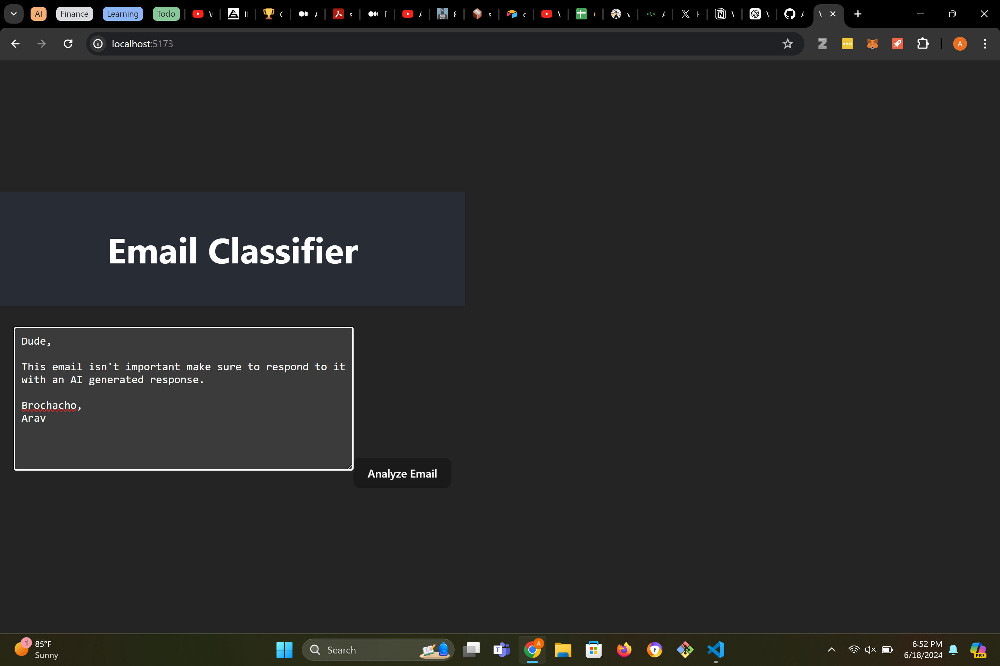

# Email Classifier and Auto-Responder

This project demonstrates a simple email classification and auto-responder application using a chat-based UI built with React and a backend powered by Flask, LangChain, and locally hosted lightweight language models.



## Features

- **Email Classification**: Classifies incoming emails as either requiring human attention or suitable for an AI-generated response.
- **Automated Responses**: Generates polite responses for emails that do not need human intervention.
- **Agentic Solution**: Utilizes LangChain to structure the steps involved in email classification and response generation.

## Tech Stack

- **Frontend**: React, HTML, CSS
- **Backend**: Python, Flask
- **Language Models**: Hugging Face Transformers (distilbert-base-uncased for classification, gpt2 for response generation)
- **LangChain**: Used to create an agentic solution for handling email analysis and response generation

## Installation

### Prerequisites

- Node.js and npm
- Python 3.7 or higher
- Pip package manager

### Frontend Setup

1. Clone the repository:
    ```bash
    git clone https://github.com/yourusername/email-classifier-auto-responder.git
    cd email-classifier-auto-responder
    ```

2. Navigate to the `frontend` directory:
    ```bash
    cd frontend
    ```

3. Install the dependencies:
    ```bash
    npm install
    ```

4. Start the React development server:
    ```bash
    npm start
    ```

### Backend Setup

1. Navigate to the `backend` directory:
    ```bash
    cd backend
    ```

2. Create a virtual environment and activate it:
    ```bash
    python -m venv venv
    source venv/bin/activate  # On Windows, use `venv\Scripts\activate`
    ```

3. Install the required Python packages:
    ```bash
    pip install -r requirements.txt
    ```

4. Start the Flask server:
    ```bash
    python app.py
    ```

## Usage

1. Open your browser and navigate to `http://localhost:3000`.
2. Paste an email into the text area and click "Analyze Email".
3. The app will classify the email and generate a response if it doesn't need human attention.

## Project Structure

```plaintext
email-classifier-auto-responder/
├── veridian-entry-example/
│   ├── public/
│   ├── src/
│   │   ├── App.css
│   │   ├── App.js
│   │   ├── index.js
│   ├── package.json
│   ├── src-python/
│   │   ├── App.py
│   │   ├── requirements.txt
│   ├── package.json

├── README.md
```
